# 📦 Packge: nxp
flutter\nxp_nfcApp\nxp

## App 設定
- 設定雲端host及接口
- 設定拍照檔案裁切大小
- 設定客制設定檔初始路徑

##### - 📁 [nxp/assets/config.yaml](assets/config.yaml)

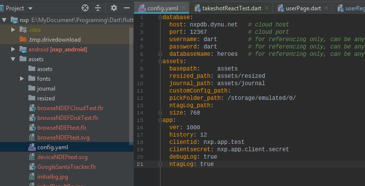

- ##### database
    > - __username__ 
        主要作為參照用, 無功能, 不得刪除
    > - __password__
        主要作為參照用, 無功能, 不得刪除
    > - __databaseNme__
        主要作為參照用, 無功能, 不得刪除
    > - __host__
        設定雲端資料庫HOST位址, APP會以該位址作為接口
    > - __port__
        設定資料庫PORT
   
    以圖示為例, 資料庫位址為 
    [http://nxpdb.dynu.net:12367](http://nxpdb.dynu.net:12367)

- ##### assets
    > - __basepath__: __assets__
    > - __resized_path__: __assets/resized__
    > - __journal_path__: __assets/journal__
    > - __customConfig_path__:   
        無功用, 以APP內設定的路徑為主
    > - __pickFolder_path__: __/storage/emulated/0__  
        APP設定客制路徑時的起點,   
        以Documents為例 - /storage/emulated/0/Documents
    > - __ntagLog_path__:  
        無功用, 不得刪除
    > - __size__: __768__  
        拍照後預設圖片大小,如原圖大小為 2048x1536, 拍照後會儲存為1024X768

- ##### app
    > - __ver__ 
        無功用, 不得刪除
    > - __history__  
        無功用, 不得刪除
    > - __debugLog__: __true__ 
    > - __ntagLog__: __true__
    > - __clientid__: OAuth clientid -   
        帳號授權取得時所參照之ID, 需與DATABASE設定一致,
        才能於DB端取得帳戶豋入授權
    > - __clientsecret__: OAuth clientsecret -   
        帳號授權取得時所參照之加密密錀, 需與DATABASE設定一致,   
        才能於DB端取得帳戶豋入授權
    
    

> __NOTE:__   
> 任何新增或刪除需在 nxp_bloc/lib/impl/config.dart
> 進行增補及刪除

> 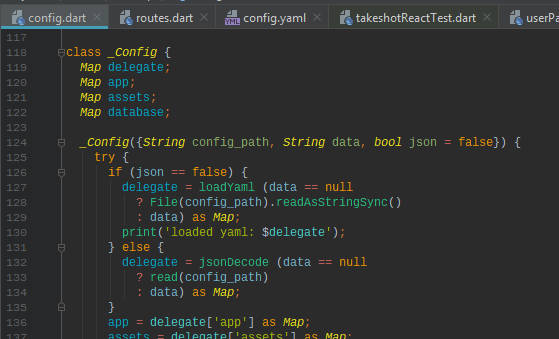

> __NOTE:__  
> 該config 由 nxp/lib/main.dart 讀入

> 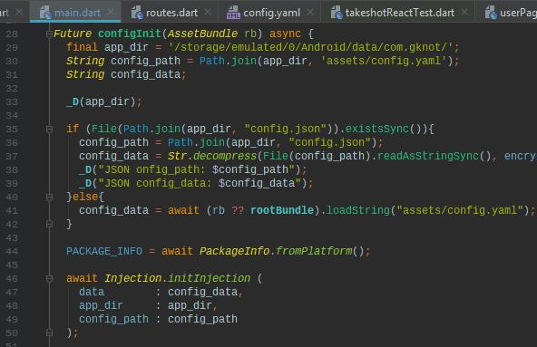

## App routing
為APP增減頁面時,需變更以下檔案
#### ⛓ 關連檔案
 - 📁 [nxp/lib/route.dart](assets/lib/route.dart)
 - 📁 [nxp/lib/Strings.dart](assets/lib/Strings.dart)

###### 新增設定App route需考慮到以下步驟
1. __📁 [nxp/lib/Strings.dart](assets/lib/Strings.dart)__  
    設定ENUM MAPPING, 設定字串與ENUM的映射關係

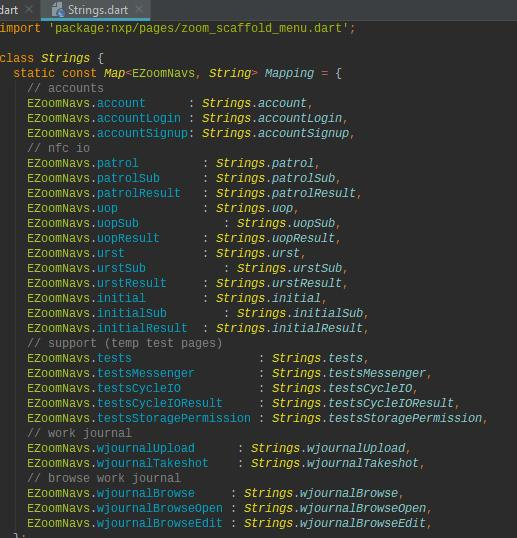

2. __📁 [nxp/lib/route.dart](assets/lib/route.dart)__  
    設定ENUM MAPPING, 設定ENUM與Routing 間的關係

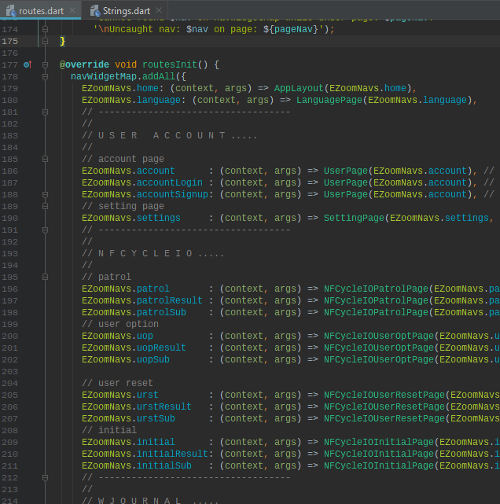

3. __📁 [nxp/lib/route.dart](assets/lib/route.dart)__  
    設定Routing transition

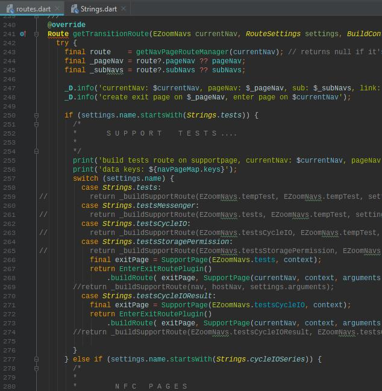

4. __📁 [nxp/lib/route.dart](assets/lib/route.dart)__  
    設定page route entry

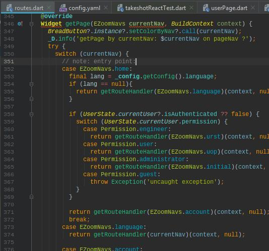

## App 頁面entry
#### ⛓ 關連檔案
 - 🗁 [nxp/lib/pages](assets/lib/pages)
   - 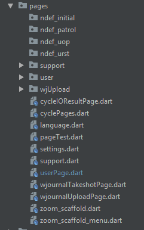
    - cyclePages - nfc 頁面
    - languages - 選擇語系初始頁面
    - settings - APP設定頁面
    - userPge
      - userLogin - 使用者登入
      - userRegister - 使用者註冊
      - userAuthorized - 使用者登出
    - wjournal - 工作日誌
      - wjournalTakeshotPage - 拍照頁面
      - wjournalUploadPage   - 上傳頁面
    - zoom_scaffold - 主選單
      - zoom_scaffold_menu - 主選單 
      
### App UI Reactive logic
主要使用[MobX](https://mobx.pub/) 及 [BloC](https://pub.dev/packages/bloc) 這二個Framework,
前期使用bloc, 後期使用Mobx, 有些以MobX重寫, 有些則無, 因此部份BloC logic 沒有使用到.

- 🗁 [nxp/lib/bloc](assets/lib/bloc)
  - 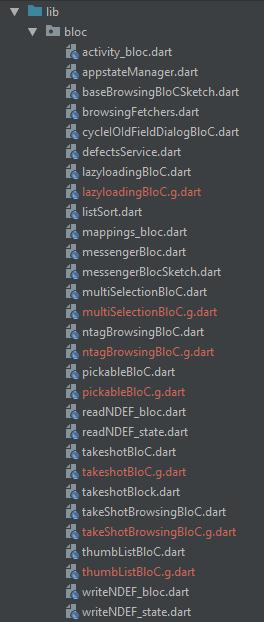
  
  
### App Dependency Injector
App 相依注入
- 🗁 [nxp/lib/di](assets/lib/di)
- 使用於 [nxp/lib/main.dart](assets/lib/main.dart)  
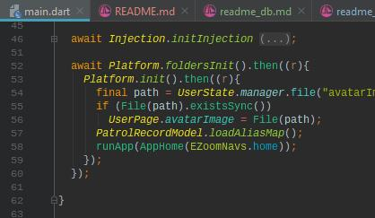

### App UI Widgets 視覺性組件
- 🗁 [nxp/lib/ui](assets/lib/ui)  
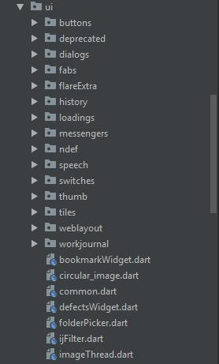

- __🗁 [nxp/lib/messngers](lib/messngers)__  
  APP 信息顯示組件
