# 📦 Packge: nxp
flutter\nxp_nfcApp\nxp

## 編輯語系內容
編輯中英文化時,需變更以下檔案
#### ⛓ 關連檔案
  - 📁 [nxp/lib/consts/messages.dart](lib/consts/messages.dart)
  - 📁 [nxp/lib/pages/language.dart](lib/pages/language.dart)
#### 1.變更靜態UI之中英文化 - 📁 [nxp/lib/consts/messages.dart](lib/consts/messages.dart)
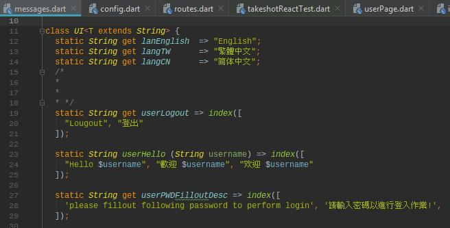
- 設定方式
    - 於UI類別下, 所有信息及以index方法包裹住,   
      分為三個欄位, 0為英文, 1為繁中, 2為簡, 如上圖

#### 2.變更App顯示的動態訊息(如寫入成功/失敗) - 📁 [nxp/lib/consts/messages.dart](lib/consts/messages.dart)

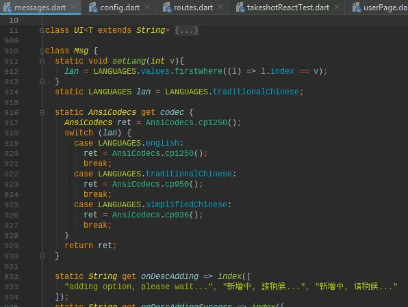
- 設定方式
    - 於Msg類別下, 所有息及以index方法包裹住,   
      分為三個欄位, 0為英文, 1為繁中, 2為簡, 如上圖

## 編輯UI
### 🗍 Account Pages
 - 📃 [signup](lib/pages/userRegister.dart)
 - 📃 [login](lib/pages/userLogin.dart)
 - 📃 [authorized](lib/pages/userAuthorized.dart)
#### 1. Signup - 📁 [userRegister.dart](lib/pages/user/userRegister.dart)

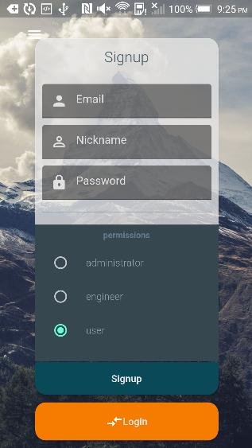

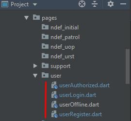

- __對應碼:__
    - __email field__: [lib/pages/user/userRegister:buildAccountNameForm](./lib/pages/user/userRegister.dart)
    - __nickname_field__: [lib/pages/user/userRegister:buildNicknameForm](./lib/pages/user/userRegister.dart)
    - __password_field__: [lib/pages/user/userRegister:buildPasswordForm](./lib/pages/user/userRegister.dart)
    - __permission_field__: [lib/pages/user/userRegister:buildPermissionRadios](./lib/pages/user/userRegister.dart)
    - 

    - __signup__: [lib/pages/user/userRegister:signup](./lib/pages/user/userRegister.dart)
    - 

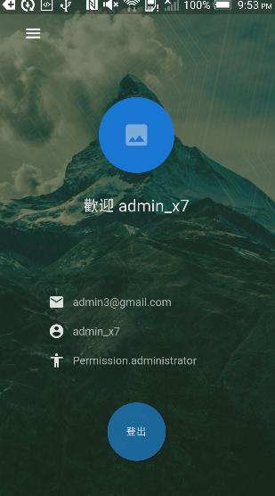

- __對應碼:__
    - __logout__: [lib/pages/user/userRegister:buildAccountNameForm](./lib/pages/user/userRegister.dart)

### 🗍 main menu
 - 📃 [zoom_scaffold_menu](lib/pages/zoom_scaffold_menu.dart)
#### nxp/lib/pages/zoom_scaffold_menu.dart
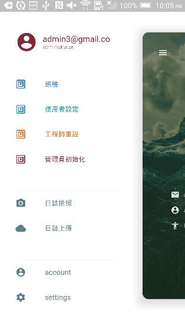

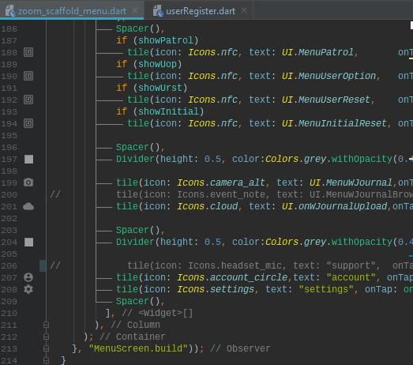  
各選單對應之程式碼如上圖

### 🗍 Settings
#### nxp/lib/pages/settings.dart

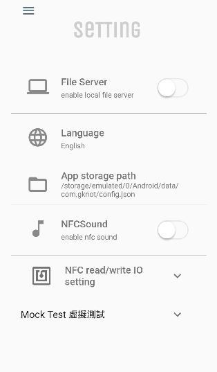

- __對應碼:__
    - __File Server__: [lib/pages/user/settings:buildLocalServerSwitch](./lib/pages/user/settings.dart)
    - __Language__: [lib/pages/user/settings:buildLanguage](./lib/pages/user/settings.dart)
    - __AppStorage__: [lib/pages/user/settings:buildCustomConfigPath](./lib/pages/user/settings.dart)
    - __NFCSound__: [lib/pages/user/settings:buildNFCSound](./lib/pages/user/settings.dart)
    - __NFC IO Setting__: [lib/pages/user/settings:buildCycleIOSettings](./lib/pages/user/settings.dart)
    - __NFC IO mock__: [lib/pages/user/settings:buildCycleIOMock](./lib/pages/user/settings.dart)
    - 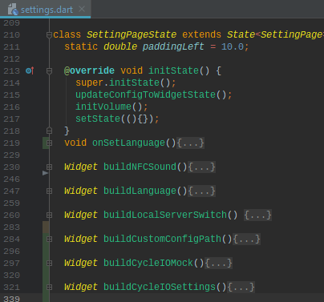

- NFC read/write IO setting  
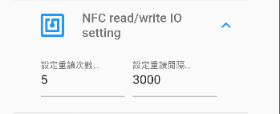  
設定通訊間隔及最大重試次數

- NFC IO mock  
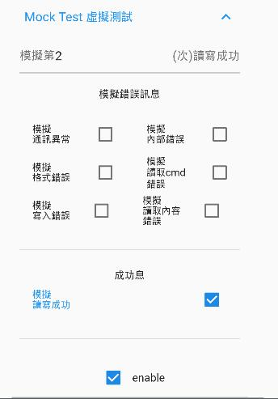  
模擬通訊於第 __N__ 次寫入 __成功__ / __失敗__,啓用模擬功能會 忽略  
實際通訊時所讀取的值, 取消有二種方式  
    - user 點選取消enable 
    - 在UI上直接取消MOCK功能, 修改 buildCycleIOMock
    - 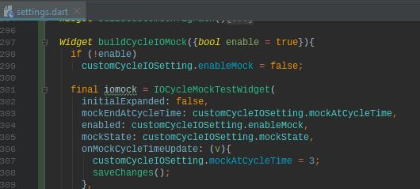  
        buildCycleIOMock({enable = true 改為   
        buildCycleIOMock({enable = false    
